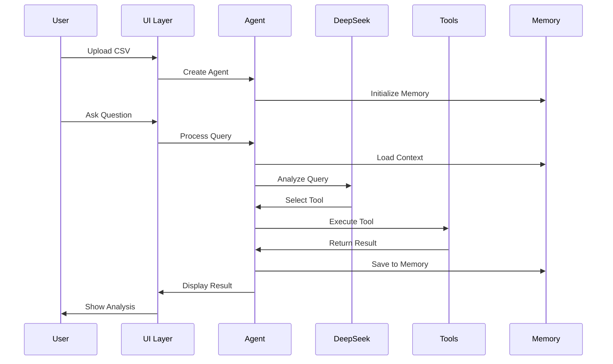

# 🏢️ Arquitetura do I2A2 EDA Agent v2.0.3

## Visão Geral

O **I2A2 EDA Agent** é uma aplicação modular de análise exploratória de dados que utiliza múltiplas LLMs para automatizar e otimizar o processo de análise. A arquitetura foi projetada para ser escalável, mantível e facilmente extensível.

**Powered by Saulo Belchior** - Versão 2.0.3 com Sistema Multi-LLM
 
 ### Diagrama de Visão Geral (Mermaid)
 
 ```mermaid
 graph LR
   U[Usuário] --> UI[Streamlit UI]
   UI --> A[LangChain Agent]
   A -- Memória --> M[Conversation Memory]
   A -- Ferramentas --> T[Tools (EDA/Visualizations/Insights)]
   T --> D[Pandas DataFrame]
   A -- LLM --> L[Multi-LLM System\nxAI Grok | Meta Llama 3.2 | DeepSeek]
   L --> F[Fallback Manager]
   F --> S[Model Selector]
   S --> O[Offline Agent]
   A --> R[Respostas/Gráficos]
   R --> UI
```
 
 ### Diagrama de Visão Geral (ASCII)
 
 ```text
 +------------------+       +---------------------+       +------------------+
 |      Usuário     | --->  |     Streamlit UI    | --->  |  LangChain Agent |
 +------------------+       +---------------------+       +------------------+
                                    |   ^                          |
                                    v   |                          v
                             +-----------------+           +------------------+
                             |  Respostas/UX   |<----------|  Conversation    |
                             +-----------------+           |     Memory       |
                                                            +------------------+
                                    |
                                    v
                          +---------------------+
                          |       Tools         |
                          | (EDA / Visual / etc)|
                          +----------+----------+
                                     |
                                     v
                       +-------------------------------+
                       |      Multi-LLM System         |
                       | xAI Grok 4 Fast              |
                       | Meta Llama 3.2 3B            |
                       | DeepSeek Free                 |
                       +---------------+---------------+
                                       |
                                       v
                               +---------------+
                               | Model Selector|
                               | & Transparency|
                               +---------------+
 
 ## 🧰 Framework escolhido: LangChain
 
 O projeto adota LangChain como framework central para aplicações com LLMs. Dentro desta arquitetura, ele:
 - **Define Tools nativas (`@tool`)**: converte funções Python (em `tools/`) em ferramentas com JSON Schema prontas para tool-calling por LLMs.
 - **Orquestra com AgentExecutor**: recebe o LLM, as ferramentas e o input do usuário; formata prompt, chama o LLM, interpreta ferramenta/argumentos, executa, e (opcionalmente) sintetiza a resposta final; também gerencia memória/histórico.
 - **Fornece Memória Conversacional**: com `ConversationSummaryBufferMemory`/`ConversationBufferWindowMemory` para manter contexto entre interações.
 - **Integra fácil com múltiplos provedores**: OpenRouter/OpenAI/Groq/Gemini/Ollama, reduzindo configuração e boilerplate.
 
 Benefício no projeto: focamos na lógica de negócio (tools e UI) enquanto o LangChain cuida da mecânica agente↔LLM↔ferramentas e da consistência do histórico.

## 🌐 Sistema Multi-LLM

### Modelos Disponíveis

1. **xAI Grok 4 Fast**
   - Contexto: 2M tokens
   - Rate Limit: 100 req/dia
   - Características: Modelo mais avançado, ideal para análises complexas

2. **Meta Llama 3.2 3B**
   - Contexto: 128k tokens
   - Rate Limit: 200 req/dia
   - Características: Balanço entre performance e velocidade

3. **DeepSeek Free**
   - Contexto: 256k tokens
   - Rate Limit: 50 req/dia
   - Características: Especializado em código e análise técnica

### Sistema de Fallback

```python
class LLMFallbackManager:
    def get_llm(self, force_provider=None):
        # 1. Se usuário selecionou modelo específico
        if force_provider is not None:
            return self._create_llm(providers[force_provider])
        
        # 2. Tentar modelos em ordem de prioridade
        for provider in providers:
            try:
                if self._is_available(provider):
                    return self._create_llm(provider)
            except Exception:
                continue
        
        # 3. Fallback para modo offline
        return OfflineAgent()
```

### Transparência e Rastreamento

- **Cabeçalho nas Respostas**: Cada resposta inclui informações do modelo usado
- **Status na Sidebar**: Mostra modelo ativo em tempo real
- **Logs Detalhados**: Rastreamento completo de qual modelo foi usado
- **Callback Personalizado**: Mostra modelo correto nos logs de execução
 
 ## Componentes Principais

### 🛠️ Tools Module
**Responsabilidade:** Ferramentas de análise de dados

```python
tools/
├── __init__.py
├── data_analysis.py    # Análise estatística
├── visualizations.py   # Gráficos e visualizações
└── insights.py        # Geração de insights
```

**Ferramentas Disponíveis:**
1. `get_data_description`: Visão geral do dataset
2. `get_descriptive_statistics`: Estatísticas descritivas
3. `plot_histogram`: Distribuição de dados
4. `plot_boxplot`: Análise de outliers (individual)
5. `plot_multiple_boxplots`: Análise de outliers (múltipla)
6. `plot_correlation_heatmap`: Correlações entre variáveis
7. `plot_scatter`: Relações bivariadas
8. `generate_insights_and_conclusions`: Síntese de análises

### 🛠️ Utils Module
**Responsabilidade:** Funções auxiliares e utilitários

```python
utils/
├── __init__.py
├── callbacks.py    # Callbacks para feedback visual
├── memory.py      # Gerenciamento de memória
└── logger.py      # Sistema de logging
```

**Funcionalidades:**
- **Callbacks:** Feedback em tempo real do processamento
- **Memory:** Gerenciamento de contexto conversacional
- **Logger:** Sistema unificado de logging

### 🎨 UI Module
**Responsabilidade:** Componentes de interface do usuário

```python
ui/
├── __init__.py
└── components.py   # Componentes reutilizáveis
```

**Componentes:**
- `render_sidebar()`: Barra lateral com upload
- `render_chat_interface()`: Interface de chat principal
- `render_suggestions()`: Sugestões de perguntas
- `render_history()`: Histórico de análises
- `initialize_session_state()`: Estado da sessão

## Fluxo de Execução

### 1. Inicialização
```
app.py → setup_logging() → initialize_session_state() → render UI
```

### 2. Upload de Dados
```
User Upload → render_sidebar() → pd.read_csv() → create_eda_agent()
```

### 3. Processamento de Pergunta
```
User Input → render_chat_interface() → agent_executor.invoke() → Tool Selection → Tool Execution → Result Display
```

### 4. Geração de Insights
```
Analysis History → generate_insights_and_conclusions() → Statistical Analysis → Pattern Detection → Recommendations
```

## Diagrama de Sequência



## Padrões de Design Utilizados

### 1. **Factory Pattern**
- `create_eda_agent()`: Criação de agentes
- `create_memory()`: Criação de memória

### 2. **Decorator Pattern**
- `@tool`: Decorador para ferramentas LangChain
- Callbacks para interceptar execução

### 3. **Singleton Pattern**
- `settings`: Instância única de configurações
- Session state do Streamlit

### 4. **Strategy Pattern**
- Diferentes ferramentas como estratégias de análise
- Seleção dinâmica baseada no contexto

## Vantagens da Arquitetura

### ✅ Manutenibilidade
- Código organizado em módulos específicos
- Responsabilidades bem definidas
- Fácil localização de bugs

### ✅ Escalabilidade
- Novos módulos podem ser adicionados facilmente
- Ferramentas independentes
- Configuração centralizada

### ✅ Testabilidade
- Componentes isolados
- Mocks facilitados
- Testes unitários por módulo

### ✅ Reutilização
- Componentes genéricos em utils/
- UI components reutilizáveis
- Configurações compartilhadas

## Como Adicionar Novas Funcionalidades

### Adicionar Nova Ferramenta
1. Criar função em `tools/` com decorador `@tool`
2. Adicionar à lista `ALL_TOOLS` em `tools/__init__.py`
3. Atualizar prompt do agente se necessário

### Adicionar Novo Tipo de Visualização
1. Implementar em `tools/visualizations.py`
2. Seguir padrão de retorno `go.Figure`
3. Adicionar tratamento de erros

### Modificar Configurações
1. Editar `config/settings.py`
2. Usar `settings.CATEGORIA["parametro"]`
3. Reiniciar aplicação

### Adicionar Novo Agente
1. Criar arquivo em `agents/`
2. Implementar função de criação
3. Registrar em `agents/__init__.py`

## Performance e Otimizações

### Memória
- Window-based memory (últimas 10 interações)
- Evita overflow de contexto
- Carregamento sob demanda

### Processamento
- Ferramentas executam localmente
- Apenas decisões vão para LLM
- Cache de resultados no session_state

### UI
- Componentes lazy-loaded
- Estados preservados na sessão
- Feedback visual instantâneo

## Segurança

### Dados
- Processamento 100% local
- Não há envio de dados para APIs externas
- Apenas perguntas são enviadas ao LLM

### API Keys
- Podem ser configuradas via variáveis de ambiente
- Fallback para valores padrão em desenvolvimento
- Não expostas no código de produção

## Deployment

### Requisitos
- Python 3.8+
- Dependências em `requirements.txt`
- 2GB RAM mínimo recomendado

### Configuração para Produção
1. Definir variáveis de ambiente
2. Ajustar `settings.py` para produção
3. Configurar logging apropriado
4. Implementar rate limiting se necessário

## Roadmap Futuro

### v2.1 (Planejado)
- [ ] Suporte para múltiplos formatos (Excel, JSON)
- [ ] Cache de análises frequentes
- [ ] Export de relatórios em PDF

### v2.2 (Conceitual)
- [ ] Machine Learning automático
- [ ] Análise preditiva
- [ ] Integração com bases de dados

### v3.0 (Visão)
- [ ] Multi-agente colaborativo
- [ ] AutoML integrado
- [ ] Dashboard customizável

## Contribuindo

Para contribuir com o projeto:
1. Fork o repositório
2. Crie branch para feature (`git checkout -b feature/nova-funcionalidade`)
3. Siga os padrões de código estabelecidos
4. Adicione testes quando aplicável
5. Faça PR com descrição detalhada

## Suporte

Para questões sobre a arquitetura:
- Consulte este documento
- Verifique os comentários no código
- Abra uma issue no repositório
