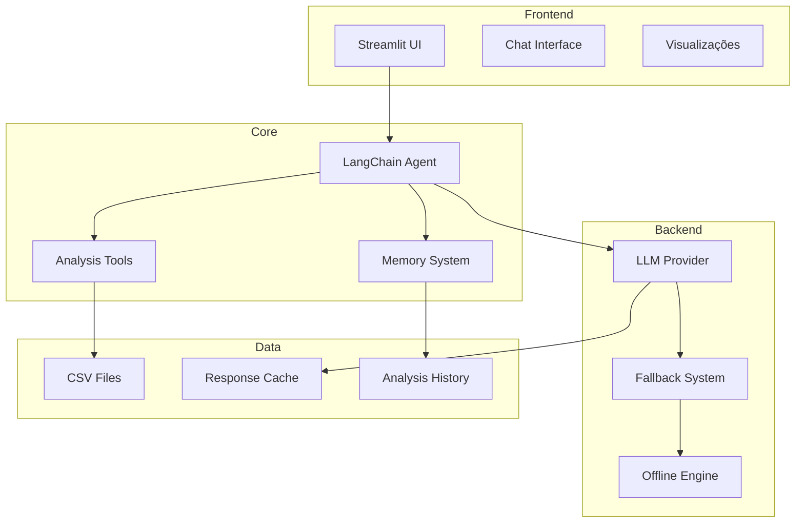

# 📚 Documentação Completa - I2A2 EDA Agent v2.0.3

## Índice

1. [Visão Geral](#visão-geral)
2. [Características Principais](#características-principais)
3. [Funcionalidades Detalhadas](#funcionalidades-detalhadas)
4. [Arquitetura da Solução](#arquitetura-da-solução)
5. [Tecnologias e Frameworks](#tecnologias-e-frameworks)
6. [Estrutura do Projeto](#estrutura-do-projeto)
7. [Instalação e Configuração](#instalação-e-configuração)
8. [Modos de Uso](#modos-de-uso)
9. [Guia de Desenvolvimento](#guia-de-desenvolvimento)
10. [Exemplos Práticos](#exemplos-práticos)
11. [Troubleshooting](#troubleshooting)
12. [Referências e Recursos](#referências-e-recursos)

---

## Visão Geral

### O que é o I2A2 EDA Agent?

O **I2A2 EDA Agent** é uma aplicação inteligente de análise exploratória de dados (Exploratory Data Analysis) que combina o poder de múltiplas LLMs com ferramentas estatísticas robustas. Desenvolvido com uma arquitetura modular e escalável, permite que analistas e cientistas de dados realizem análises complexas usando linguagem natural.

**Powered by Saulo Belchior** - Versão 2.0.3

### Propósito

- **Democratizar** a análise de dados através de interface conversacional
- **Automatizar** tarefas repetitivas de EDA
- **Acelerar** o processo de descoberta de insights
- **Manter contexto** entre análises para construção incremental de conhecimento

### Diferenciais

1. **Sistema Multi-LLM**: 3 modelos gratuitos com fallback automático
2. **Seleção de Modelo**: Usuário escolhe qual LLM usar
3. **Transparência Total**: Cada resposta mostra qual modelo foi usado
4. **Agente Inteligente com Memória**: Mantém contexto entre análises
5. **Modo Offline**: Funciona mesmo sem acesso a LLMs
6. **Arquitetura Modular**: Fácil manutenção e extensão
7. **Interface Intuitiva**: Análises complexas com comandos simples

---

## Características Principais

### 🧠 Inteligência Artificial

- **LangChain Framework**: Orquestração de agentes e ferramentas
- **Memória Conversacional**: ConversationBufferWindowMemory mantém contexto
- **Processamento de Linguagem Natural**: Entende comandos em português e inglês
- **Geração Automática de Insights**: Sintetiza descobertas em conclusões acionáveis

### 🛡️ Robustez e Confiabilidade

- **Sistema Multi-LLM**: 3 modelos gratuitos (xAI Grok, Meta Llama 3.2, DeepSeek)
- **Fallback Automático**: Troca de modelo em caso de falha
- **Seleção Manual**: Usuário pode forçar modelo específico
- **Transparência**: Cada resposta mostra qual modelo foi usado
- **Modo Offline**: Análises baseadas em regras quando LLM indisponível
- **Tratamento de Erros**: Feedback claro e opções de recuperação

### 📊 Capacidades Analíticas

- **7 Ferramentas Especializadas**: Cobertura completa de técnicas EDA
- **Geração de Insights**: Ferramenta para sintetizar conclusões
- **Visualizações Interativas**: Gráficos Plotly com zoom e exportação
- **Análise Estatística Completa**: Medidas descritivas, correlações, outliers
- **Detecção de Padrões**: Identificação automática de anomalias e tendências

### 🎨 Interface e Experiência

- **Interface Web Moderna**: Streamlit com design responsivo
- **Chat Conversacional**: Interação natural como conversa
- **Sugestões Inteligentes**: Perguntas organizadas por categoria
- **Histórico de Análises**: Rastreamento de todas as interações

---

## Funcionalidades Detalhadas

### 1. Ferramentas de Análise

#### 📋 **get_data_description**
```python
Propósito: Visão geral do dataset
Retorna: 
- Dimensões (linhas × colunas)
- Tipos de dados
- Valores ausentes
- Estatísticas básicas
```

#### 📈 **get_descriptive_statistics**
```python
Propósito: Estatísticas descritivas detalhadas
Parâmetros: column (opcional)
Retorna:
- Count, mean, std, min, max
- Quartis (25%, 50%, 75%)
- Skewness e Kurtosis
```

#### 📊 **plot_histogram**
```python
Propósito: Visualizar distribuição de variável
Parâmetros: column (obrigatório)
Retorna: Histograma interativo Plotly
```

#### 📦 **plot_boxplot**
```python
Propósito: Identificar outliers de uma coluna
Parâmetros: column (obrigatório)
Retorna: Boxplot com outliers destacados
```

#### 📦 **plot_multiple_boxplots**
```python
Propósito: Análise de outliers de todas as colunas
Parâmetros: Nenhum
Retorna: Grid de boxplots
```

#### 🔗 **plot_correlation_heatmap**
```python
Propósito: Matriz de correlação entre variáveis
Parâmetros: Nenhum
Retorna: Heatmap colorido com valores
```

#### 🎯 **plot_scatter**
```python
Propósito: Relação entre duas variáveis
Parâmetros: x_column, y_column
Retorna: Gráfico de dispersão com linha de tendência
```

#### 💡 **generate_insights_and_conclusions**
```python
Propósito: Sintetizar análises em insights
Parâmetros: Nenhum
Retorna: Conclusões baseadas no histórico
```

### 2. Modos de Operação

#### Modo Normal (Com LLM)
- Processamento completo com IA
- Entendimento de contexto complexo
- Geração de insights sofisticados
- Memória de longo prazo

#### Modo Offline (Sem LLM)
- Detecção baseada em regras
- Análise por palavras-chave
- Execução direta de ferramentas
- Fallback inteligente
#### Modo Híbrido
- Tenta LLM principal
- Último recurso: modo offline
- Transparência sobre modo usado

##  Framework escolhida: LangChain
  
  O projeto adota o LangChain como framework central para aplicações com LLMs. Ele simplifica a orquestração do agente, reduz boilerplate e garante consistência do histórico.
  
  - **Tools nativas (`@tool`)**: o decorador transforma funções Python em ferramentas com JSON Schema para tool-calling, usadas no módulo `tools/`.
  - **AgentExecutor (motor do agente)**: recebe o LLM, as ferramentas e a pergunta do usuário, e cuida de:
    - Formatar o prompt com as ferramentas disponíveis
    - Invocar o LLM e interpretar qual ferramenta e argumentos usar
    - Executar a função Python correspondente
    - (Opcional) Enviar o resultado de volta ao LLM para resposta final em linguagem natural
    - Gerenciar a memória e o histórico da sessão
  - **Memória Conversacional**: integração com `ConversationSummaryBufferMemory`/`ConversationBufferWindowMemory` preservando contexto entre interações.
  - **Integrações**: compatível com múltiplos provedores e modelos (via OpenRouter, OpenAI, Groq, Gemini, Ollama), reduzindo a configuração.
  
  Benefício no projeto: focamos na lógica das ferramentas e UX, enquanto o LangChain gerencia o ciclo agente↔LLM↔ferramentas.

## Arquitetura da Solução

### Diagrama de Visão Geral
   U[Usuário] --> UI[Streamlit UI]
   UI --> A[LangChain Agent Executor]
   A -- memória --> M[Conversation Memory]
   T --> D[DataFrame (Pandas)]
   A -- LLM --> L[LLM Providers\n(DeepSeek/Groq/Gemini/Ollama)]
   L --> F[Fallback Manager]
   F --> O[Offline Agent]
   A --> R[Respostas/Visualizações]
  ```
  R --> UI
  ```
 
 #### Diagrama (ASCII)
 
 ```text
 +------------------+       +---------------------+       +------------------+
 |      Usuário     | --->  |     Streamlit UI    | --->  | LangChain Agent  |
 +------------------+       +---------------------+       +------------------+
                                    |   ^                          |
                                    v   |                          v
                             +-----------------+           +------------------+
                             |  Respostas/UX   |<----------|  Conversation    |
                             +-----------------+           |     Memory       |
                                                            +------------------+
                                    |
                                    v
                          +---------------------+
                          |       Tools         |
                          | (EDA / Visual / etc)|
                          +----------+----------+
                                     |
                                     v
                            +-------------------+
                            | Pandas DataFrame  |
                            +-------------------+
                                     |
                                     v
                       +-------------------------------+
                       |        LLM Providers          |
                       |       DeepSeek /  Groq /      |
                       |        Gemini / Ollama        |
                       +---------------+---------------+
                                       |
                                       v
                                +--------------+
                                | Fallback Mgr |
                                +------+-------+
                                       |
                                       v
                                +--------------+
                                | OfflineAgent |
                                +--------------+
 
### Visão de Alto Nível



### Componentes Principais

#### 1. **Camada de Apresentação (UI)**
- Framework: Streamlit
- Componentes: Chat, Upload, Visualizações, Histórico
- Responsabilidade: Interface usuário, renderização

#### 2. **Camada de Processamento (Agent)**
- Framework: LangChain
- Componentes: Agent Executor, Tools, Memory
- Responsabilidade: Orquestração, decisão, execução

#### 3. **Camada de Inteligência (LLM)**
- Providers: DeepSeek, Groq, Gemini, Ollama
- Sistema: Multi-provider com fallback
- Responsabilidade: NLP, geração, entendimento

#### 4. **Camada de Dados**
- Storage: Session State (Streamlit)
- Formato: DataFrames (Pandas)
- Persistência: Memória de sessão

### Fluxo de Dados

```
1. Usuário → Pergunta em linguagem natural
2. UI → Captura e envia para Agent
3. Agent → Processa com LLM
4. LLM → Identifica ferramenta apropriada
5. Tool → Executa análise no DataFrame
6. Result → Retorna para Agent
7. Agent → Formata resposta
8. UI → Exibe resultado ao usuário
```

---

## Tecnologias e Frameworks

### Core Technologies

| Tecnologia | Versão | Propósito |
|------------|--------|-----------|
| **Python** | 3.8+ | Linguagem base |
| **Streamlit** | 1.32.0+ | Interface web |
| **LangChain** | 0.1.0+ | Framework de IA |
| **Pandas** | 2.0.0+ | Manipulação de dados |
| **Plotly** | 5.18.0+ | Visualizações |
| **NumPy** | 1.24.0+ | Computação numérica |
| **SciPy** | 1.10.0+ | Estatísticas avançadas |

### LLM Providers (com Fallback Inteligente)

| Provider | Modelo | Tipo | Rate Limit | Contexto |
|----------|--------|------|------------|----------|
| **DeepSeek** | deepseek-chat-v3.1:free | Gratuito | 50/dia | 256k |
| **xAI Grok** | grok-4-fast:free | Gratuito | 100/dia | 2M |
| **Google Gemini** | gemini-2.5-flash-lite | Gratuito | 150/dia | 1M |
| **Meta Llama** | llama-3.2-3b:free | Gratuito | 200/dia | 128k |
| **Groq** | Llama-3.1-8b | Gratuito | 300/dia | 128k |

### Sistema de Fallback

O sistema tentará os provedores:
- **DeepSeek** (principal, ótimo para português)
- **xAI Grok 4** (2M de contexto, excelente para análises grandes)
- **Google Gemini 2.5** (1M de contexto, rápido e eficiente)
- **Meta Llama 3.2** (bom desempenho geral)

### Bibliotecas Auxiliares

```python
langchain-openai      # Integração OpenAI
langchain-community   # Tools comunitárias
openai               # Cliente OpenAI
python-dotenv        # Variáveis ambiente
typing-extensions    # Type hints
dataclasses         # Data structures
```

---

## Estrutura do Projeto

### Organização de Diretórios

```
I2A2 - Desafio Extra/
│
├── 📁 config/              # Configurações centralizadas
│   ├── __init__.py
│   ├── settings.py         # Configurações principais
│   └── settings_alternatives.py  # Configurações de fallback
│
├── 📁 agents/              # Agentes de IA
│   ├── __init__.py
│   ├── eda_agent.py       # Agente principal
│   └── offline_agent.py   # Agente offline
│
├── 📁 tools/               # Ferramentas de análise
│   ├── __init__.py
│   ├── data_analysis.py   # Ferramentas descritivas
│   ├── visualizations.py  # Ferramentas visuais
│   └── insights.py        # Gerador de insights
│
├── 📁 utils/               # Utilitários
│   ├── __init__.py
│   ├── callbacks.py       # Callbacks Streamlit
│   ├── memory.py          # Sistema de memória
│   └── llm_fallback.py    # Gerenciador de fallback
│
├── 📁 ui/                  # Interface do usuário
│   ├── __init__.py
│   └── components.py       # Componentes UI
│
├── 📄 app_refatorado.py    # Aplicação principal (v2.0)
├── 📄 app_backup.py        # Backup versão monolítica
├── 📄 requirements.txt     # Dependências
├── 📄 README.md           # Documentação básica
├── 📄 ARCHITECTURE.md     # Arquitetura detalhada
├── 📄 MIGRATION_GUIDE.md  # Guia de migração
├── 📄 CHANGELOG.md        # Histórico de mudanças
├── 📄 VERSION             # Controle de versão
└── 📄 DOCUMENTATION.md    # Este arquivo
```

### Módulos e Responsabilidades

#### **app_refatorado.py** (80 linhas)
- Ponto de entrada da aplicação
- Configuração inicial
- Orquestração de componentes

#### **config/settings.py**
- Configurações do LLM
- Parâmetros do sistema
- Constantes globais

#### **agents/eda_agent.py**
- Criação do agente LangChain
- Configuração de memória
- Integração com ferramentas

#### **agents/offline_agent.py**
- Motor de regras offline
- Detecção de intenção
- Fallback inteligente

#### **tools/*.py**
- Implementação das ferramentas
- Lógica de análise
- Geração de visualizações

#### **utils/*.py**
- Funções auxiliares
- Callbacks customizados
- Gerenciamento de estado

#### **ui/components.py**
- Componentes visuais
- Renderização de chat
- Gestão de interface

---

## Instalação e Configuração

### Requisitos do Sistema

- Python 3.8 ou superior
- 4GB RAM mínimo (8GB recomendado)
- 500MB espaço em disco
- Conexão internet (para LLMs cloud)

### Instalação Rápida

```bash
# 1. Clone o repositório
git clone <repository-url>
cd "I2A2 - Desafio Extra"

# 2. Crie ambiente virtual
python -m venv venv
source venv/bin/activate  # Linux/Mac
# ou
venv\Scripts\activate  # Windows

# 3. Instale dependências
pip install -r requirements.txt

# 4. Execute a aplicação
streamlit run app_refatorado.py
```

### Configuração de API Keys

#### Opção 1: Arquivo .env
```bash
# .env
OPENROUTER_API_KEY=sk-or-v1-your-key-here
OPENAI_API_KEY=sk-your-openai-key
GROQ_API_KEY=gsk_your-groq-key
GOOGLE_API_KEY=your-google-key
```

#### Opção 2: Variáveis de Ambiente
```bash
export OPENROUTER_API_KEY="sk-or-v1-your-key"
export OPENAI_API_KEY="sk-your-key"
```

#### Opção 3: Direto no código
```python
# config/settings.py
LLM_CONFIG = {
    "api_key": "your-key-here",
    ...
}
```
---

## Modos de Uso

### 1. Uso Básico - Interface Web

1. **Iniciar aplicação**
   ```bash
   streamlit run app_refatorado.py
   ```

2. **Carregar dados**
   - Clique em "Browse files"
   - Selecione arquivo CSV
   - Aguarde carregamento

3. **Fazer perguntas**
   - Digite no campo de chat
   - Pressione Enter
   - Visualize resultados

### 2. Uso Avançado - Comandos Específicos

#### Análise Completa
```
"Faça uma análise completa incluindo estatísticas, distribuições, outliers e correlações"
```

#### Análise Direcionada
```
"Analise a variável Amount mostrando distribuição, outliers e correlações"
```

#### Comparações
```
"Compare V1 com V2 usando scatter plot"
"Mostre a relação entre Time e Amount"
```

#### Insights
```
"Gere conclusões sobre os dados analisados"
"Quais padrões você identificou?"
```

### 3. Uso Programático

```python
# Importar componentes
from agents.eda_agent import create_eda_agent
from tools import ALL_TOOLS
import pandas as pd

# Carregar dados
df = pd.read_csv("data.csv")

# Criar agente
agent = create_eda_agent()

# Executar análise
result = agent.invoke({
    "input": "Análise completa dos dados"
})

print(result['output'])
```

### 4. Modo Offline

Quando o LLM não está disponível:

```python
from agents.offline_agent import offline_agent

# Usar comandos diretos
result = offline_agent.invoke({
    "input": "estatísticas descritivas"
})
```

---

## Guia de Desenvolvimento

### Adicionando Nova Ferramenta

#### 1. Criar arquivo em tools/
```python
# tools/my_tool.py
from langchain.tools import tool
import streamlit as st

@tool
def my_custom_analysis(parameter: str) -> str:
    """Descrição da ferramenta."""
    df = st.session_state.df
    # Implementação
    return "Resultado"
```

#### 2. Registrar em tools/__init__.py
```python
from .my_tool import my_custom_analysis

ALL_TOOLS = [
    ...,
    my_custom_analysis
]
```

#### 3. Atualizar agente offline (opcional)
```python
# agents/offline_agent.py
self.keyword_tool_mapping = {
    ...,
    'minha_palavra': 'my_custom_analysis'
}
```

### Modificando Configurações

```python
# config/settings.py
class Settings:
    # LLM Config
    LLM_CONFIG = {
        "model_name": "novo-modelo",
        "temperature": 0.2,
        "max_tokens": 3000
    }
    
    # System Config
    MAX_FILE_SIZE = 200_000_000  # 200MB
    SUPPORTED_FORMATS = ['.csv', '.xlsx']
    
    # UI Config
    CHAT_HEIGHT = 500
    SIDEBAR_WIDTH = 300
```

### Testando Componentes

```python
# tests/test_tools.py
import pytest
from tools.data_analysis import get_data_description

def test_data_description():
    result = get_data_description()
    assert "Informações Gerais" in result
    assert "Dimensões" in result
```

---

## Exemplos Práticos

### Exemplo 1: Análise de Fraude em Cartões

```python
# Dataset: creditcard.csv
Perguntas sugeridas:

1. "Visão geral dos dados de fraude"
2. "Estatísticas da coluna Amount"
3. "Existe correlação entre as variáveis V?"
4. "Identifique outliers em Amount"
5. "Compare transações normais vs fraude"
6. "Gere conclusões sobre padrões de fraude"
```

### Exemplo 2: Análise de Vendas

```python
# Dataset: sales.csv
Workflow:

1. "Descrição geral do dataset de vendas"
2. "Qual a distribuição de vendas por mês?"
3. "Existem outliers nos valores de venda?"
4. "Correlação entre preço e quantidade"
5. "Tendências temporais nas vendas"
6. "Principais insights sobre o negócio"
```

### Exemplo 3: Análise Exploratória Completa

```python
# Comando único para análise completa:
"Execute uma análise exploratória completa incluindo:
1. Descrição dos dados
2. Estatísticas de todas as variáveis
3. Identificação de outliers
4. Matrix de correlação
5. Principais distribuições
6. Geração de insights e recomendações"
```

---

## Troubleshooting

### Problemas Comuns e Soluções

#### 1. Rate Limit Excedido
**Erro:** `Rate limit exceeded: free-models-per-day`

**Soluções:**
- Adicione créditos no OpenRouter ($10 = 1000 req/dia)
- Use provider alternativo (Groq, Gemini)
- Use modo offline temporariamente

#### 2. Erro de Memória
**Erro:** `'query' KeyError`

**Solução:**
```python
# Limpar sessão
streamlit run app_refatorado.py --server.runOnSave true
```

#### 3. Arquivo CSV Não Carrega
**Erro:** `Error loading file`

**Verificar:**
- Encoding (usar UTF-8)
- Separador (vírgula padrão)
- Tamanho < 200MB
- Formato válido

#### 4. Gráficos Não Aparecem
**Erro:** Visualização em branco

**Soluções:**
- Atualizar Plotly: `pip install --upgrade plotly`
- Limpar cache: `streamlit cache clear`
- Verificar dados numéricos

#### 5. LLM Não Responde
**Erro:** Timeout ou sem resposta

**Verificar:**
- API Key válida
- Conexão internet
- Provider disponível
- Usar fallback system

### Logs e Debug

#### Ativar logs detalhados
```python
# config/settings.py
LOGGING_LEVEL = "DEBUG"
```

#### Verificar logs
```bash
# Terminal onde roda streamlit
tail -f ~/.streamlit/logs/*.log
```

#### Debug mode
```python
# app_refatorado.py
import streamlit as st
st.set_page_config(page_title="EDA Agent", layout="wide")
st.write(st.session_state)  # Debug session
```

---

## Referências e Recursos

### Documentação Oficial

- [LangChain Docs](https://python.langchain.com/docs/get_started/introduction)
- [Streamlit Docs](https://docs.streamlit.io/)
- [Plotly Python](https://plotly.com/python/)
- [Pandas User Guide](https://pandas.pydata.org/docs/user_guide/index.html)

### Tutoriais e Guias

- [Building AI Agents with LangChain](https://www.langchain.com/agents)
- [Streamlit Best Practices](https://blog.streamlit.io/best-practices/)
- [EDA with Python](https://www.kaggle.com/learn/data-visualization)

---

## Apêndices

### A. Glossário de Termos

| Termo | Definição |
|-------|-----------|
| **EDA** | Exploratory Data Analysis - Análise Exploratória de Dados |
| **LLM** | Large Language Model - Modelo de Linguagem Grande |
| **Agent** | Sistema autônomo que toma decisões |
| **Tool** | Ferramenta executável pelo agente |
| **Memory** | Sistema de memória conversacional |
| **Fallback** | Sistema de contingência |
| **Provider** | Fornecedor de serviço LLM |
| **Outlier** | Valor atípico nos dados |
| **Correlation** | Relação estatística entre variáveis |

### B. Comandos Rápidos

```bash
# Desenvolvimento
streamlit run app_refatorado.py --server.runOnSave true

# Produção
streamlit run app_refatorado.py --server.headless true

# Debug
streamlit run app_refatorado.py --logger.level debug

# Performance
streamlit run app_refatorado.py --server.enableCORS false
```

### C. Variáveis de Ambiente

```bash
# LLM Configuration
OPENROUTER_API_KEY=
OPENAI_API_KEY=
GROQ_API_KEY=
GOOGLE_API_KEY=

# System Configuration
STREAMLIT_SERVER_PORT=8501
STREAMLIT_SERVER_ADDRESS=localhost
STREAMLIT_THEME=dark

# Debug
LANGCHAIN_VERBOSE=true
STREAMLIT_LOGGER_LEVEL=info
```

---

## Licença e Créditos

### Licença
MIT License - Uso livre com atribuição

### Autores
- Desenvolvimento: Time de Engenharia
- Arquitetura: Solution Architects
- UI/UX: Design Team

### Agradecimentos
- LangChain Community
- Streamlit Team
- OpenRouter/DeepSeek
- Comunidade Open Source

---

**Versão:** 2.0.1  
**Última Atualização:** 2025-09-28  
**Status:** Produção  
**Contato:** [suporte@exemplo.com]

---

*Esta documentação é um documento vivo e será atualizada continuamente com melhorias e novos recursos.*
