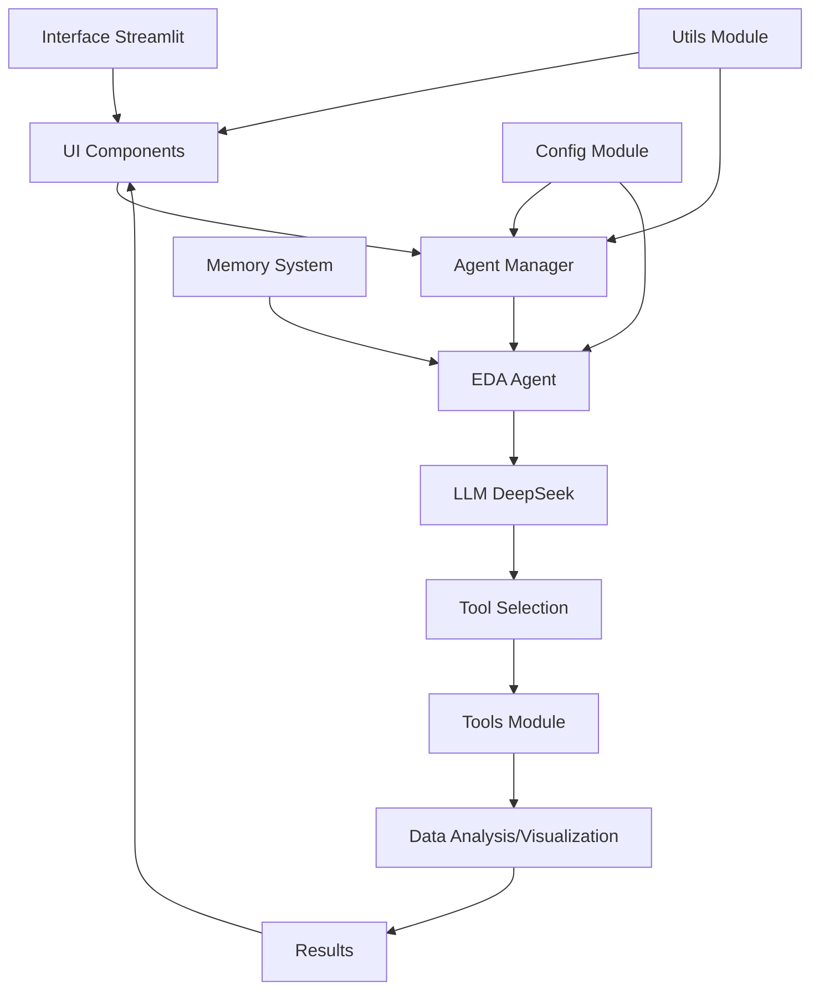

# 🤖 I2A2 EDA Agent - Análise Exploratória Inteligente

**Versão 2.0.4** | Powered by Saulo Belchior

Uma aplicação Streamlit avançada que combina múltiplas LLMs com análise de dados para fornecer insights automáticos e interativos sobre seus datasets.

## 🚀 Deploy no Streamlit Cloud

**🔴 ATENÇÃO:** Se você está vendo a mensagem "LLM indisponível" no Streamlit Cloud:

👉 **[Leia o guia de configuração rápida: QUICK_FIX.md](QUICK_FIX.md)**

Você precisa configurar a API key nos **Secrets** do Streamlit Cloud. É rápido (3 minutos)!

### Link da Aplicação
- **Produção:** https://i2a2desafioextra-saulobelchior.streamlit.app/

## ✨ Funcionalidades Principais

- **🔍 Análise Automática**: IA analisa seus dados e sugere insights relevantes
- **📊 Visualizações Dinâmicas**: Gráficos interativos gerados automaticamente
- **🧠 Memória Contextual**: Mantém contexto entre perguntas para análises cumulativas
- **🎯 Insights Inteligentes**: Geração automática de conclusões baseadas em evidências
- **⚡ Interface Intuitiva**: Chat interativo para exploração natural dos dados
- **🔄 Multi-LLM**: Sistema de fallback com 3 modelos gratuitos funcionais
- **🎛️ Seleção de Modelo**: Usuário pode escolher qual LLM usar para cada análise
- **📈 Transparência Total**: Cada resposta mostra qual modelo foi usado

## 🚀 Tecnologias Utilizadas

- **Streamlit**: Interface web moderna e responsiva
- **LangChain**: Framework para aplicações com IA
- **Multi-LLM**: xAI Grok, Meta Llama 3.2, DeepSeek (3 modelos gratuitos)
- **OpenRouter**: API unificada para múltiplas LLMs
- **Pandas**: Manipulação e análise de dados
- **Plotly**: Visualizações interativas
- **Python 3.8+**: Linguagem base da aplicação
- 💡 **Geração de Insights** - Conclusões baseadas em evidências
- 🚀 **Arquitetura Modular v2.0** - 90% menos código no arquivo principal
- 🆓 **100% Gratuito** - Usa apenas LLMs gratuitas do OpenRouter

## 🎛️ Modelos LLM Disponíveis

### Modelos Gratuitos Funcionais:
1. **xAI Grok 4 Fast** - 2M tokens de contexto, 100 req/dia
2. **Meta Llama 3.2 3B** - 128k tokens de contexto, 200 req/dia
3. **DeepSeek Free** - 256k tokens de contexto, 50 req/dia

### Sistema de Fallback:
- **Fallback Automático**: Tenta modelos em ordem de prioridade
- **Seleção Manual**: Usuário escolhe o modelo específico
- **Transparência Total**: Cada resposta mostra qual modelo foi usado

## 📊 Ferramentas de Análise Disponíveis

1. **get_data_description**: Visão geral completa do dataset
2. **get_descriptive_statistics**: Estatísticas descritivas detalhadas
3. **plot_histogram**: Visualização de distribuições
4. **plot_boxplot**: Identificação de outliers
5. **plot_correlation_heatmap**: Matriz de correlação interativa
6. **plot_scatter**: Análise de relações entre variáveis
7. **generate_insights_and_conclusions**: Síntese de todas as análises

## 🛠️ Instalação

### Pré-requisitos
- Python 3.8 ou superior
- pip (gerenciador de pacotes Python)

### Passos de Instalação

1. Clone o repositório ou baixe os arquivos:
```bash
git clone <seu-repositorio>
cd "I2A2 - Desafio Extra"
```

2. Instale as dependências:
```bash
pip install -r requirements.txt
```

## 🎯 Como Usar

### Executar a Aplicação
```bash
streamlit run app_refatorado.py
```

2. Acesse no navegador:
```
http://localhost:8501
```

3. **Carregue seus dados**:
   - Clique em "Browse files" na barra lateral
   - Selecione um arquivo CSV
   - Ou use o dataset de exemplo clicando no botão "🎲 Usar Dataset de Exemplo"

4. **Faça perguntas sobre seus dados**:
   - Digite perguntas naturais no chat
   - O agente automaticamente escolherá a ferramenta apropriada

## 💬 Exemplos de Perguntas

- "Me dê uma visão geral dos dados"
- "Mostre um histograma da coluna salario"
- "Crie um boxplot para identificar outliers na coluna experiencia"
- "Mostre a matriz de correlação entre as variáveis"
- "Faça um gráfico de dispersão entre idade e salario"
- "Quais são suas conclusões sobre os dados?"
- "Que insights você pode gerar?"
- "Existem padrões ou tendências temporais?"

 ## 🧰 Framework escolhida: LangChain

O projeto utiliza o LangChain como framework central para construção de aplicações com LLMs. Ele abstrai o fluxo complexo de chamadas ao modelo, orquestração de ferramentas e gestão de memória, reduzindo drasticamente o boilerplate.

- **Conceito de Tools nativo**: o decorador `@tool` transforma funções Python em ferramentas utilizáveis pelo agente, gerando automaticamente a especificação (JSON Schema) necessária para LLMs com tool-calling.
- **AgentExecutor (motor do agente)**: recebe o LLM, a lista de ferramentas e a pergunta do usuário. Ele:
  - Formata o prompt com as ferramentas disponíveis
  - Chama o LLM
  - Interpreta qual ferramenta usar e seus argumentos
  - Executa a função Python correspondente
  - (Opcional) Envia o resultado de volta ao LLM para resposta final em linguagem natural
  - Gerencia memória e histórico do chat
- **Memória conversacional**: integração nativa com memórias como `ConversationSummaryBufferMemory` ou `ConversationBufferWindowMemory`, permitindo contexto entre interações.
- **Integrações prontas**: conecta-se facilmente a múltiplos provedores e modelos (incluindo via OpenRouter), simplificando a configuração.
- **Benefício no projeto**: focamos na lógica das ferramentas (`tools/`) e UX, enquanto o LangChain cuida do ciclo agente↔LLM↔ferramentas e da consistência do histórico.

## 🏗️ Arquitetura Modular
 
 ### Diagrama de Visão Geral
 
 ```mermaid
 graph LR
   U[Usuário] --> UI[Streamlit UI]
   UI --> A[LangChain Agent]
   A -- Memória --> M[Conversation Memory]
   T --> D[Pandas DataFrame]
   A -- LLM --> L[LLM Providers\nDeepSeek | OpenAI | Groq | Gemini | Ollama]
   L --> F[Fallback Manager]
   F --> O[Offline Agent]
   A --> R[Respostas/Gráficos]
    R --> UI
  ```
 
  #### Diagrama (ASCII)
  
  ```text
  +------------------+       +---------------------+       +------------------+
  |      Usuário     | --->  |     Streamlit UI    | --->  |  LangChain Agent |
  +------------------+       +---------------------+       +------------------+
                                     |   ^                          |
                                     v   |                          v
                              +-----------------+           +------------------+
                              |  Respostas/UX   |<----------|  Conversation    |
                              +-----------------+           |     Memory       |
                                                             +------------------+
                                     |
                                     v
                           +---------------------+
                           |       Tools         |
                           | (EDA / Visual / etc)|
                           +----------+----------+
                                      |
                                      v
                             +-------------------+
                             | Pandas DataFrame  |
                             +-------------------+
                                      |
                                      v
                        +-------------------------------+
                        |        LLM Providers          |
                        | DeepSeek / OpenAI / Groq /    |
                        | Gemini / Ollama               |
                        +---------------+---------------+
                                        |
                                        v
                                 +--------------+
                                 | Fallback Mgr |
                                 +------+-------+
                                        |
                                        v
                                 +--------------+
                                 | OfflineAgent |
                                 +--------------+
  ```
  
  ### Estrutura de Diretórios
```
I2A2 - Desafio Extra/
├── app_refatorado.py      # Aplicação principal
├── config/                # Configurações
│   ├── __init__.py
│   ├── __init__.py
│   └── eda_agent.py      # Agente de análise exploratória
├── tools/                 # Ferramentas de análise
│   ├── __init__.py
│   ├── data_analysis.py  # Análise de dados
│   ├── visualizations.py # Visualizações
│   └── insights.py       # Geração de insights
├── utils/                 # Utilitários
│   ├── __init__.py
│   ├── callbacks.py      # Callbacks do Streamlit
│   ├── memory.py         # Gerenciamento de memória
│   └── logger.py         # Sistema de logging
├── ui/                    # Interface do usuário
│   ├── __init__.py
│   └── components.py     # Componentes da UI
└── requirements.txt       # Dependências
```

### Fluxo de Dados


### Stack Tecnológico

- **Frontend**: Streamlit
- **Orquestração**: LangChain
- **LLMs**: xAI Grok 4 Fast, Meta Llama 3.2 3B, DeepSeek Free
- **API Gateway**: OpenRouter
- **Processamento**: Pandas, NumPy
- **Visualização**: Plotly

## 🔒 Segurança e Privacidade

- **Processamento Local**: Todos os cálculos e análises são executados localmente
- **Dados Seguros**: Seus dados nunca são enviados para servidores externos
- **Roteamento Inteligente**: Apenas as perguntas (não os dados) são enviadas ao LLM

## 📝 Notas Importantes

1. A aplicação usa uma API key do OpenRouter já configurada (versão free)
2. Sistema de fallback automático entre 3 LLMs gratuitas
3. Toda análise pesada é feita localmente com Pandas e Plotly
4. Para grandes datasets, considere fazer sampling antes do upload
5. Cada resposta mostra qual modelo LLM foi usado
6. Usuário pode selecionar modelo específico ou usar fallback automático

## 🐛 Troubleshooting

### Erro de instalação de dependências
```bash
pip install --upgrade pip
pip install -r requirements.txt --no-cache-dir
```

### Aplicação não abre no navegador
- Verifique se a porta 8501 está disponível
- Use: `streamlit run app.py --server.port 8502`

### Erro ao carregar CSV
- Verifique se o arquivo está em formato CSV válido
- Certifique-se que o encoding está correto (UTF-8 recomendado)

## 📄 Licença

Este projeto foi desenvolvido como demonstração educacional do uso de agentes LLM para análise de dados.

## 🤝 Contribuições

Contribuições são bem-vindas! Sinta-se à vontade para:
- Adicionar novas ferramentas de análise
- Melhorar as visualizações
- Otimizar o prompt do agente
- Adicionar suporte para outros formatos de arquivo

## 📧 Contato

Para dúvidas ou sugestões, abra uma issue no repositório.
